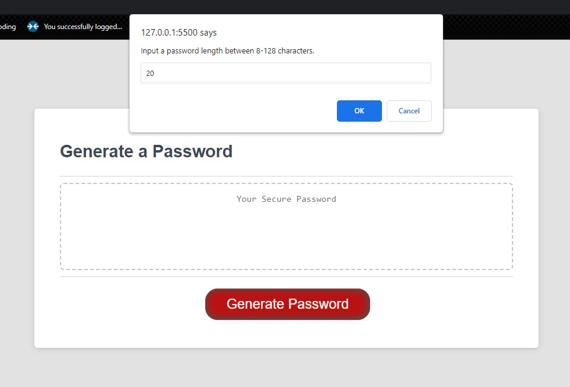

# password-generator-x

## Description

- My motivation behind this project was my need to learn more about javacript and the functionality behind the scened of the apps.
- This project was built to help consuments take the thinking out of passwords. It allows you to designate a length, type of characters to use and in the end, it genereates a random password to use in your accounts.

## Usage

- to use the app just follow these steps:
- 1. when propted, set the max length of the pasword requered.
- 2. when propted, set the characters desired in the password. For example, $, #, and % are all character that can be use in the password.
- 3. press the generate button and it will generate a randome password for you to use in your online accounts.
- 4. copy your password and use it where ever yo like.
- 5. your are all done.

- insert some screenshots of the process usage.

## Images

## Github links

GitHub repo: https://github.com/Sal1316/password-generator-x
Published site: https://github.io.com/Sal1316/password-generator-x

git add -A
git commit -m 'uploaded images to README file'
git push origin main
